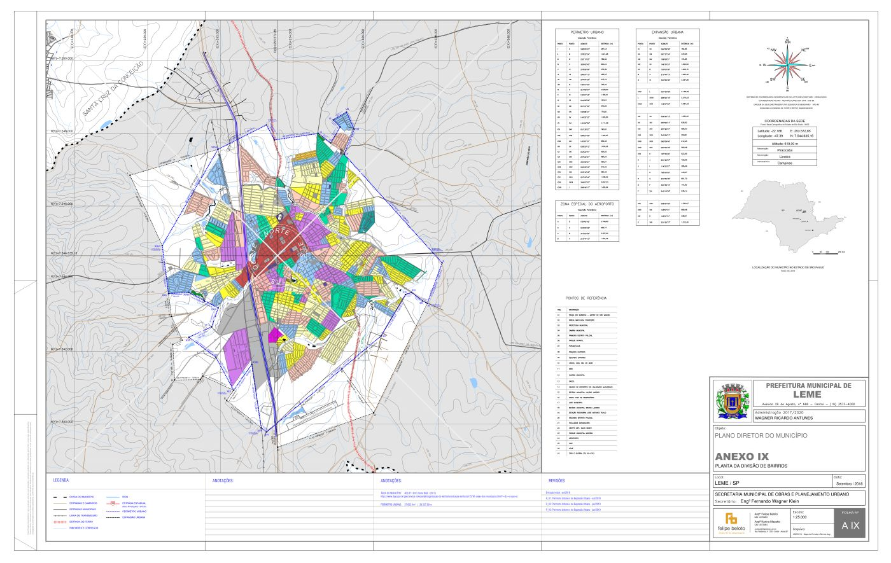
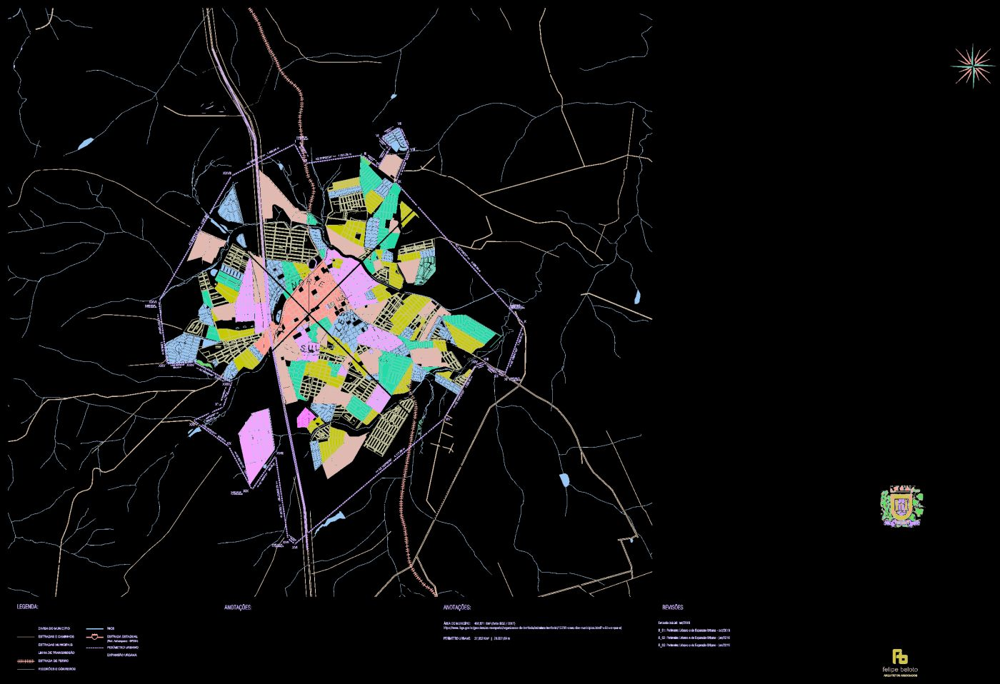
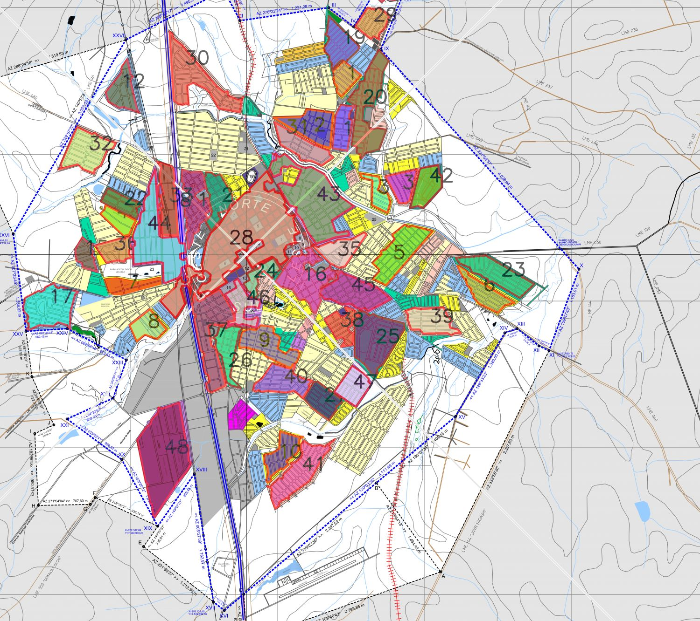

# geopy

Estudo de vetorização de mapas temáticos com visão computacional. Transforma uma planta em PDF (por exemplo, a divisão de bairros de um plano diretor) em uma camada vetorial GeoJSON, extraindo polígonos a partir das regiões coloridas.

O caso de estudo é a **Planta da Divisão de Bairros (Anexo IX) do Plano Diretor de Leme/SP**, de 2018, incluída em [`plana-bairros.pdf`](plana-bairros.pdf).



## Pipeline

1. **Renderização** da página a 300 DPI com PyMuPDF.
2. **Recorte** automático da área de interesse.
3. **Segmentação por cor**, em uma de duas estratégias:
   - `hsv`: limiar de saturação e valor, que gera uma máscara única com todas as cores;
   - `kmeans` (padrão): k-means nos canais a\*/b\* do espaço CIELAB, isolando a crominância da luminância. Cada cluster é processado separadamente, o que evita fundir bairros vizinhos de cores diferentes.
4. **Limpeza**: abertura e fechamento morfológicos, preenchimento de buracos, área mínima e filtro de compacidade (4πA/P²), este pensado para descartar feições lineares como rodovias, drenagem e curvas de nível.
5. **Vetorização**: contornos com OpenCV, simplificação por Douglas-Peucker e correção de geometrias com Shapely.
6. **Georreferenciamento** (opcional) por pontos de controle (GCPs), com transformação afim ajustada por mínimos quadrados.
7. **Exportação** em GeoJSON.

## Scripts

| Script | Descrição |
|---|---|
| [`pdf_map_to_vectors.py`](pdf_map_to_vectors.py) | Primeira versão: segmentação por limiar HSV em resolução cheia. |
| [`pdf_map_to_vectors_upgrade.py`](pdf_map_to_vectors_upgrade.py) | Versão atual: k-means em Lab, recorte por cor, imagem de trabalho reduzida e filtro de compacidade. |

## Estrutura

```
geopy/
├── pdf_map_to_vectors.py           # v1: segmentação HSV
├── pdf_map_to_vectors_upgrade.py   # versão atual: k-means em Lab
├── plana-bairros.pdf               # planta de origem (caso de estudo)
├── bairros_pixel.geojson           # resultado de exemplo (48 polígonos)
├── docs/                           # imagens usadas neste README
└── requirements.txt
```

## Instalação

Requer Python 3.10 ou superior.

```bash
git clone git@github.com:alexandremartinx/geopy.git
cd geopy
python3 -m venv .venv
.venv/bin/pip install -r requirements.txt
```

## Uso

```bash
# Coordenadas em pixels (sem georreferenciamento)
.venv/bin/python pdf_map_to_vectors_upgrade.py --pdf plana-bairros.pdf --out bairros_pixel.geojson --debug-dir debug

# Segmentação por HSV
.venv/bin/python pdf_map_to_vectors_upgrade.py --pdf plana-bairros.pdf --segment hsv --out out.geojson

# Com georreferenciamento: CSV com colunas pixel_x,pixel_y,x,y (3 ou mais pontos)
.venv/bin/python pdf_map_to_vectors_upgrade.py --pdf plana-bairros.pdf --gcp gcps.csv --epsg 29193 --out bairros.geojson
```

Os valores `pixel_x` e `pixel_y` dos GCPs são coordenadas de `debug/render.png`, a página inteira. O script compensa sozinho o deslocamento do recorte.

Para esta prancha, os cruzamentos da grade UTM impressa servem como GCPs. As posições abaixo foram medidas no render a 300 DPI, com precisão de cerca de 1 px (~2 m):

```csv
pixel_x,pixel_y,x,y
1917,1734,250000,7548000
5697,1734,258000,7548000
1917,5514,250000,7540000
5697,5514,258000,7540000
```

As coordenadas da grade estão em **SAD 69 / UTM fuso 23S (EPSG:29193)**, conforme a nota da própria prancha: *"COORDENADAS PLANO - RETANGULARES EM UTM - SAD 69"*, meridiano central 45° W.

Principais parâmetros: `--k` (número de clusters), `--chroma-min`, `--min-area-px`, `--close-ksize`, `--compactness-min` e `--max-side`. A lista completa sai com `--help`.

## Artefatos de debug

Com `--debug-dir`, cada etapa grava um artefato para inspeção:

| Arquivo | Conteúdo |
|---|---|
| `render.png` | Página renderizada |
| `crop.png` / `crop_box.json` | Área recortada e suas coordenadas no render |
| `work_resized.png` | Imagem reduzida em que a segmentação é executada |
| `mask_overview.png` | Pixels com crominância mínima (só para inspeção) |
| `kmeans_selected_preview.png` | Clusters selecionados, pintados com a cor do centro |
| `mask.png` | Máscara binária (somente no modo `hsv`) |
| `polys_overlay.png` | Contornos dos polígonos sobre o recorte |
| `affine_matrix_2x3.txt` | Matriz afim (somente com `--gcp`) |



## Escopo técnico

Esta seção descreve o modo `kmeans` do [`pdf_map_to_vectors_upgrade.py`](pdf_map_to_vectors_upgrade.py) com os parâmetros padrão. Os números foram medidos executando as funções do script sobre `debug/work_resized.png`, com sementes fixas de 0 a 4.

### Espaços de coordenadas

| Espaço | Tamanho | Conversão | 1 px equivale a |
|---|---|---|---|
| PDF | 2778 × 1757 pt | 1 pt = 1/72" | — |
| Render | 11575 × 7321 px | × 300/72 = 4,1667 | 0,0847 mm no papel ≈ 2,116 m no terreno |
| Recorte | 9976 × 6830 px | render − (522, 186) | 2,116 m |
| Trabalho | 2600 × 1780 px | recorte ÷ 3,8369 | 8,12 m |

A segmentação acontece no espaço de trabalho. Os vértices são multiplicados por 3,8369 e voltam ao recorte, que é o espaço do GeoJSON. No georreferenciamento, somam-se (522, 186) para voltar ao render antes de aplicar a afim.

A escala foi conferida pela grade UTM da prancha: as linhas aparecem a cada 945,0 px nos dois eixos, o que equivale a 80,0 mm no papel para 2000 m no terreno, ou seja, 1:25.000.

### Rasterização

O MuPDF rasteriza o conteúdo vetorial com a matriz `diag(4,1667; 4,1667)` e anti-aliasing. O buffer RGB (`pix.samples`) vira array com `np.frombuffer(...).reshape(h, w, 3)`, sem cópia, e é convertido para BGR, a convenção do OpenCV.

O anti-aliasing cria, em toda borda entre dois preenchimentos, uma faixa de 1 a 2 px com cores misturadas que não pertencem a nenhuma classe do mapa. As etapas seguintes precisam lidar com essa faixa.

### Recorte automático

Uma máscara HSV (`S ≥ 18`, `V ≥ 35`) passa por abertura 5×5 e fechamento 5×5 com 2 iterações. O recorte é a bounding box de todos os pixels positivos, mais 80 px de margem.

Como a bounding box usa o mínimo e o máximo das coordenadas, basta um componente colorido em qualquer ponto da folha (rosa dos ventos, brasão, logotipo) para esticá-la. Nesta prancha, o recorte `[522, 186, 10497, 7015]` cobre 86% da largura da folha.

### Imagem de trabalho

A imagem é reduzida para 2600 px no lado maior com `INTER_AREA`, que calcula a média da área de cada pixel de destino. Cada pixel de trabalho resume 14,7 pixels do render, o que alarga as faixas de cores misturadas nas bordas.

Os parâmetros ficam em unidades diferentes: `min_area_px` e `approx_eps` valem em pixels de trabalho, mas `simplify_tol` é aplicado depois da multiplicação por 3,8369, em pixels do recorte. Com 1,5 px do recorte (3,2 m), ele fica abaixo da tolerância de Douglas-Peucker (7,7 px do recorte) e, na prática, não altera as geometrias.

### Segmentação por k-means

No OpenCV em 8 bits, os canais Lab são `L₈ = L*·255/100`, `a₈ = a* + 128` e `b₈ = b* + 128`. A crominância é `C = √((a₈−128)² + (b₈−128)²)`, equivalente a C\*ab.

1. **Candidatos:** entram os pixels com `45 ≤ L₈ ≤ 250` (L\* entre 17,6 e 98,0) e `C ≥ 2`, para descartar branco, preto e cinza neutro.
2. **Treino:** 90.000 candidatos sorteados sem reposição e sem semente fixa. As features são só `(a₈, b₈)`. O `cv2.kmeans` roda com k = 14, inicialização k-means++, 3 tentativas (fica a de menor Σ‖x − c‖²) e parada em 30 iterações ou deslocamento dos centros menor que 1,0.
3. **Seleção:** ficam os clusters cujo centro tem `C ≥ 12` (12 de 14 nas 5 execuções). Os clusters de baixa crominância funcionam como classe de descarte para cinzas e pixels misturados, por isso k é maior que o número de cores de preenchimento.
4. **Atribuição:** cada pixel da imagem recebe o centro mais próximo em (a, b), por distância euclidiana quadrática vetorizada (14 × 4,6 milhões de operações). Os não candidatos recebem o rótulo −1.

Usar só a\* e b\* torna a classificação estável à mistura com o branco do anti-aliasing, que aproxima o ponto da origem sem mudar muito o ângulo de matiz. O custo é que cores que diferem apenas em luminosidade caem no mesmo cluster.

O teto `L₈ ≤ 250` foi pensado para cortar o branco, mas também corta tons pastel:

| Cor (BGR) | Pixels | L₈ | C | Passa em `L₈ ≤ 250`? |
|---|---|---|---|---|
| amarelo-claro (191, 255, 255) | 23.260 | 252 | 32,6 | não |
| salmão (191, 206, 255) | 17.732 | 221 | 20,5 | sim |
| magenta (237, 127, 210) | 17.620 | 168 | 65,9 | sim |
| azul-claro (255, 204, 153) | 15.096 | 205 | 30,3 | sim |

O amarelo-claro é a cor de preenchimento mais frequente do mapa e recebe o rótulo −1 antes do k-means. No total, 7,9% dos pixels cromáticos (`C ≥ 12`) têm `L₈ > 250` e são descartados por esse teto.

Na v1 ([`pdf_map_to_vectors.py`](pdf_map_to_vectors.py)), o equivalente é `v_max = 245` sobre `V = max(R, G, B)`. Amarelo-claro, salmão, azul-claro, amarelo e azul têm V = 255, então a v1 descarta a maioria dos preenchimentos.

### Morfologia

Cada cluster vira uma máscara binária, tratada separadamente:

- **Abertura** com elemento elíptico 3×3, que no OpenCV é uma cruz: remove estruturas de 1 a 2 px, como halos de anti-aliasing, texto e linhas da mesma cor do cluster.
- **Fechamento** com elemento elíptico 5×5 e `iterations=2`: o OpenCV executa duas dilatações e depois duas erosões, o que equivale a um fechamento com disco de ~9×9. Lacunas de até ~8 px de trabalho (~65 m) são fechadas. As linhas de arruamento dentro dos bairros medem cerca de 2 px, então as quadras de um bairro se unem em um único componente.
- **Preenchimento de buracos:** `floodFill` a partir do pixel (0, 0), inversão do resultado e OR com a máscara. O método supõe que (0, 0) é fundo. Se o canto for primeiro plano, a máscara inteira fica preenchida; isso não ocorreu nesta prancha, mas uma borda de 1 px de zeros antes do `floodFill` eliminaria o risco.

A divisa entre dois bairros vizinhos da mesma cor também é uma linha fina, de 1 a 2 px. O mesmo fechamento que une as quadras funde os dois bairros. Para uma segmentação baseada só em cor e morfologia, rua interna e divisa são o mesmo sinal visual.

### Componentes, contornos e polígonos

1. **Componentes conexos:** `connectedComponentsWithStats` com conectividade 8. Componentes com menos de 1200 px de trabalho são descartados, o que equivale a 1200 × 8,12² m², cerca de **7,9 ha** no terreno.
2. **Contorno:** `findContours` (seguimento de borda de Suzuki–Abe) com `RETR_EXTERNAL` e `CHAIN_APPROX_SIMPLE`. Fica o maior contorno de cada componente.
3. **Simplificação:** `approxPolyDP` (Ramer–Douglas–Peucker) com ε = 2 px de trabalho, cerca de 16 m. Os vértices são então multiplicados por 3,8369.
4. **Validação:** geometrias com autointerseção são reconstruídas com `buffer(0)`, que pode partir o polígono em um MultiPolygon ou apagar partes finas.
5. **Compacidade de Polsby–Popper** `4πA/P²`: vale 1 no círculo e 0,785 no quadrado. Para um retângulo 1×n, fica perto de π/n, então o limite de 0,02 só elimina faixas com proporção acima de ~1:157. Nas 5 execuções, o filtro não rejeitou nenhum componente: as feições lineares já tinham sido eliminadas pela abertura e pela área mínima.

Cada polígono é traçado de forma independente, com o contorno passando pelo centro dos pixels de borda (~½ px para dentro, cerca de 4 m). As bordas de bairros vizinhos não coincidem, então o resultado tem frestas e sobreposições em vez de uma cobertura com arestas compartilhadas.

### Georreferenciamento

A transformação afim tem 6 parâmetros:

```
E = a·px + b·py + c
N = d·px + e·py + f
```

Cada GCP fornece 2 equações, então são necessários pelo menos 3 pontos não colineares. Cada eixo é resolvido com `np.linalg.lstsq` (SVD). O script não reporta os resíduos, então não há RMSE do ajuste. Os buracos dos polígonos são descartados no passo que soma o deslocamento do recorte.

Nesta prancha, as linhas da grade estão alinhadas aos eixos da imagem, e a afim se reduz a escala e translação com o eixo Y invertido. Em pixels do render:

```
E = 252 000   + (px − 2862) × 2,1164
N = 7 546 000 − (py − 2679) × 2,1164
```

A relação foi validada pelas linhas da sede do município (E = 253.572,85; N = 7.544.635,16), que ficam fora do espaçamento regular: a fórmula prevê px = 3605,2 e py = 3323,9, e as linhas detectadas estão em 3605 e 3324. Para coordenadas do GeoJSON, use `px = x_recorte + 522` e `py = y_recorte + 186`.

O datum da grade é SAD 69 (EPSG:29193). Declarar SIRGAS 2000 (EPSG:31983) deslocaria o resultado pela diferença entre os dois data, da ordem de dezenas de metros. A RFC 7946 exige GeoJSON em WGS 84 (lon/lat); o script grava o EPSG em um arquivo `.meta.json` à parte, mas o correto é reprojetar para EPSG:4326 ou exportar em GeoPackage com o CRS declarado.

## Resultados

O arquivo [`bairros_pixel.geojson`](bairros_pixel.geojson) contém **48 polígonos** extraídos no modo `kmeans`, em coordenadas de pixel do recorte e com o eixo Y para baixo.



O resultado é parcial. As causas, medidas conforme o [escopo técnico](#escopo-técnico):

| Causa | Etapa | Evidência |
|---|---|---|
| O teto `L₈ ≤ 250` elimina o amarelo-claro (L₈ = 252), a cor de preenchimento mais frequente | Segmentação | 7,9% dos pixels cromáticos descartados. Com teto 254, o total passa de 52–56 para 65–67 polígonos, e o amarelo-claro é capturado em 5 de 5 execuções |
| Área mínima de ~7,9 ha | Componentes | Um bairro azul-claro com 1174 px ficou de fora do limite de 1200 px |
| O fechamento funde bairros vizinhos da mesma cor | Morfologia | A divisa entre bairros é fechada do mesmo modo que o arruamento interno |
| O recorte por bounding box é esticado por elementos coloridos fora do mapa | Recorte | A caixa cobre 86% da largura da folha |
| Amostragem e k-means++ sem semente fixa | Segmentação | De 52 a 56 polígonos em 5 sementes; a execução publicada deu 48 |

Além disso, os polígonos não têm nome, não estão georreferenciados e não compartilham arestas com os vizinhos.

## Próximos passos

- Subir o teto de luminância dos candidatos (por exemplo, `L₈ ≤ 254`) e definir a área mínima em hectares, não em pixels.
- Fixar a semente (`np.random.seed` e `cv2.setRNGSeed`) para tornar o resultado reprodutível.
- Adicionar uma borda de zeros antes do `floodFill` em `fill_holes`.
- Associar os nomes dos bairros a partir do texto extraível do PDF (`page.get_text("words")`), via ponto-em-polígono.
- Georreferenciar pela grade da prancha em EPSG:29193 e reprojetar para EPSG:4326 na exportação.
- Avaliar a leitura direta dos vetores do PDF, quando o arquivo os preserva.

## Stack

Python, PyMuPDF, OpenCV, NumPy e Shapely.

## Fonte dos dados

Prefeitura Municipal de Leme/SP, Plano Diretor do Município, Anexo IX – Planta da Divisão de Bairros (setembro de 2018).
